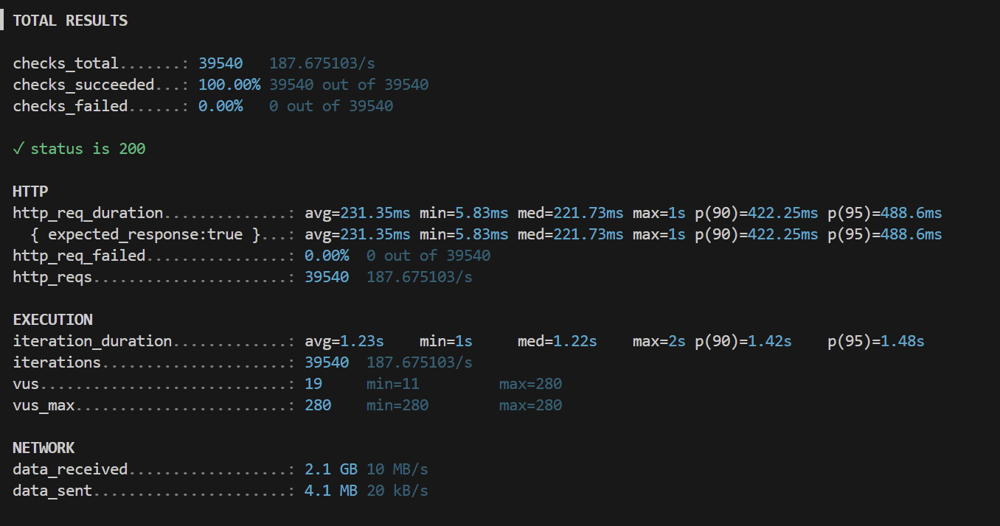
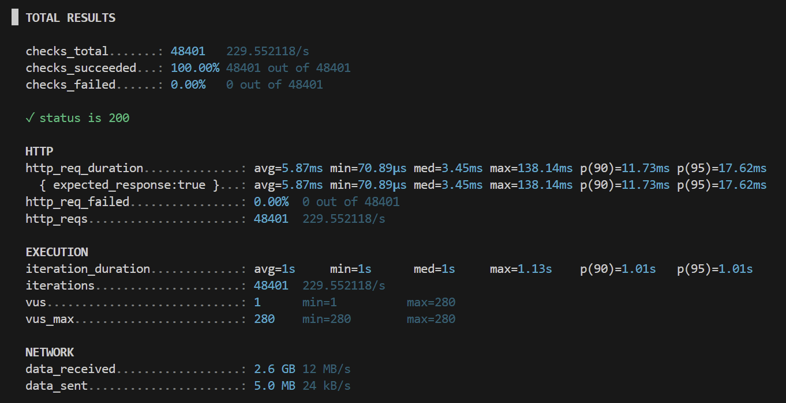
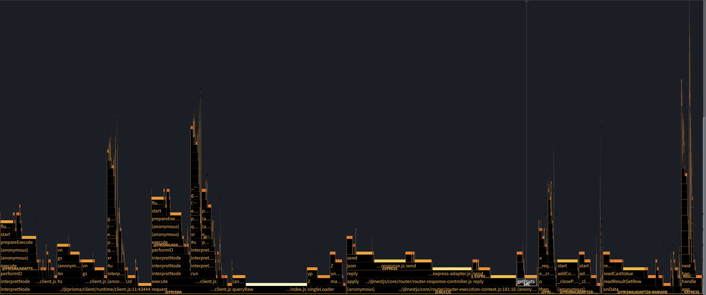
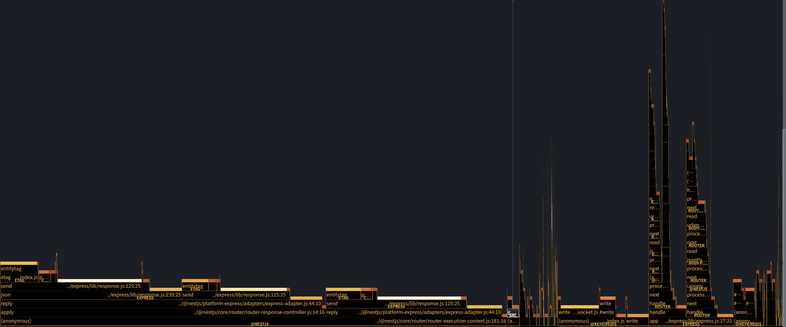

# 실험 03: Redis 캐싱 도입 전/후 성능 분석

## 배경

목록 조회 API에 Redis 캐싱(keyv + @keyv/redis + cache-manager)을 도입했을 때 성능 향상을 기대했고, 예상대로 응답 시간이 큰 폭으로 개선되는 것을 확인했다. 처음에는 이를 단순히 "메모리 vs 디스크" 캐싱 효과로 해석했지만, 수치를 자세히 들여다보면서 그 해석이 틀렸다는 것을 확인하고 실제 병목을 추적했다.

## 목표

Redis 캐싱 도입으로 인한 성능 개선이 정말 "디스크 I/O 절감" 때문인지 검증하고, 아니라면 실제 원인을 찾는다.

## 조건

- 애플리케이션: Nest + Prisma
- DB: MariaDB (local)
- 캐시: keyv + @keyv/redis + cache-manager
- 부하 도구: k6
- 비교 항목: DB 직접 조회 vs Redis 캐시 조회
- 부하 강도: 평소(max 280 VUs)

## 변경 내용 / 실험 설계

- 목록 조회 API에 Redis 캐시 레이어 추가 (keyv + @keyv/redis + cache-manager)
- 동일 부하 시나리오(max 280 VUs, 동일 duration)로 도입 전/후 비교
- 성능 차이의 원인을 추적하기 위해 MySQL 버퍼풀 상태 카운터와 `clinic flame` CPU 프로파일링을 추가로 수집

## 결과

### 부하테스트 결과 (k6)

| 구분 | Redis 도입 전 | Redis 도입 후 |
|---|---:|---:|
| 총 요청 수 | 39,540 | 48,401 |
| 처리량 (req/s) | 187.68 | 229.55 |
| 평균 응답시간 (avg) | 231.35ms | 5.87ms |
| 중앙값 (med) | 221.73ms | 3.45ms |
| p90 | 422.25ms | 11.73ms |
| p95 | 488.6ms | 17.62ms |
| max | 1s | 138.14ms |

**Redis 도입 전**

**Redis 도입 후**

평균 응답시간이 231.35ms → 5.87ms로 약 39배 감소했고, 처리량은 187.68 → 229.55 req/s로 증가했다. 실패율은 두 경우 모두 0%.

## 분석

### 가설 1: "디스크 I/O가 줄어든 것 아닐까?"

학교 OS 수업에서 배운 대로라면, 메모리(캐시)와 디스크 간의 접근 속도 차이는 보통 수십 ms 수준(대략 20ms 내외)이다. 그런데 실측 평균 차이는 약 200ms로, 단순 디스크 I/O 절감으로 설명하기엔 자릿수가 맞지 않았다. 게다가 캐싱 도입 전 상태에서, 쿼리 자체는 단순한데도 app 컨테이너의 CPU 사용률이 약 140%까지 올라가는 것을 Docker Desktop에서 확인했다. 이 두 가지가 "디스크 I/O 절감" 가설과 맞지 않는 단서였다.

**검증: MySQL 버퍼풀 히트율 확인**

MySQL(InnoDB)은 디스크 접근 전에 buffer pool(메모리)을 먼저 거치는 구조다. 즉 반복되는 동일 쿼리라면 캐싱 여부와 무관하게 이미 버퍼풀에서 응답했을 가능성이 높다. 이를 확인하기 위해 다음 두 지표의 테스트 전/후 델타를 측정했다.

- `Innodb_buffer_pool_reads` — 버퍼풀에 없어서 실제 디스크를 읽은 횟수
- `Innodb_buffer_pool_read_requests` — 버퍼풀에 대한 전체 읽기 요청 수

측정 결과 `Innodb_buffer_pool_reads`는 테스트 전/후로 거의 증가하지 않았다. 즉 캐싱 도입 전에도 이미 버퍼풀(메모리)에서 데이터를 읽고 있었고, 실제 디스크 접근은 애초에 병목이 아니었다.

**→ "디스크 I/O 절감" 가설 기각.**

### 가설 2: CPU를 실제로 잡아먹는 것은 무엇인가

디스크가 원인이 아니라면 CPU를 잡아먹는 다른 무언가가 있다는 뜻이었다. 단순 반복문이나 bcrypt 같은 무거운 연산은 코드에 없었기 때문에, `clinic flame`으로 실제 요청 처리 중 각 함수가 CPU를 얼마나 점유하는지 프로파일링하고 AI 도구로 분석했다.

**Redis 도입 전 (Prisma → MariaDB 직접 조회)**

CPU self-time 상위 항목:

| 비율 | 함수 |
|---|---|
| 18.5% | `libc.so.6` (네이티브 시스템콜/메모리 연산) |
| 4.5% | `queryRaw` (`@prisma/adapter-mariadb`) |
| 3.6% | `ObjectAssign` (V8 내장) |
| 2.7% | `readCastValue` (mariadb 드라이버 파서) |
| 1.9%, 1.5%, 1.1% | `yp`/`vn`/`gs` 등 Prisma 런타임 함수 |

누적(inclusive) 기준으로는 Prisma의 JS 쿼리 인터프리터 `interpretNode`가 26.4%, mariadb 드라이버 관련 함수(`performIO`, `execute`, `prepareExecute`, `addCommandEnablePipeline`)가 각각 10~13%를 차지했다. 즉 CPU 140%의 상당 부분은 **Prisma의 JS 쿼리 엔진 실행 + mariadb 프로토콜 파싱/직렬화**에 쓰이고 있었다. 단순한 쿼리라도 Prisma가 결과를 매핑하고 mariadb 드라이버가 바이너리 프로토콜을 파싱하는 과정 자체가 CPU 비용이었던 것이다.

**Redis 도입 후 (keyv + @keyv/redis + cache-manager)**

CPU self-time 상위 항목:

| 비율 | 함수 |
|---|---|
| 33.0% | `deserializeData` (`keyv/dist/index.cjs`) |
| 16.5% | `libc.so.6` |
| 4.2% | `get` (`keyv/dist/index.cjs`) |
| 2.4% | `entitytag` (etag 생성) |

DB 왕복은 사라졌지만 예상 밖의 지점에서 병목이 재발견됐다. `deserializeData` 단일 함수가 전체 CPU 샘플의 1/3을 차지하고 있었다. 콜스택을 따라가 보면 `keyv`의 `get()` → `deserializeData` → `@keyv/serialize`의 `defaultDeserialize`로 이어지는데, 이는 Redis에서 받아온 문자열을 JS 객체로 복원하는 **JSON 역직렬화** 구간이었다.

### 검증 결과: "메모리 vs 디스크"가 아니라 "동기 연산의 종류가 바뀐 것"

두 프로파일을 비교하면, Redis 캐싱이 개선한 것은 디스크 접근이 아니라 **Prisma 쿼리 엔진 인터프리팅 + mariadb 프로토콜 파싱**이라는, 매 요청마다 반복되던 무거운 CPU 작업이었다. 대신 그 자리를 **JSON 역직렬화(`deserializeData`)**가 상당 부분 대체했다.

`interpretNode`, mariadb 파싱 함수들, `deserializeData` 모두 **동기(synchronous) 함수**이기 때문에, 실행되는 동안 이벤트루프가 완전히 멈춘다. DB 쿼리 자체(소켓 대기)는 비동기라 그 시간 동안 다른 요청을 처리할 수 있지만, 이 동기 함수들이 실행되는 순간에는 다른 모든 요청도 함께 블로킹된다.

즉 "메모리가 디스크보다 빠르다"는 단순한 설명으로는 200ms 격차도, 140% CPU 사용률도 설명되지 않았고, 실제로는 **요청마다 반복 실행되던 무거운 JS 연산(쿼리 인터프리팅 vs JSON 역직렬화)의 성능 차이 + 처리 과정에서의 레이어 감소**가 성능 차이의 핵심이었다.

## 결론

- Redis 캐싱으로 평균 응답시간이 231.35ms → 5.87ms(약 39배)로 개선됐지만, 원인은 "디스크 I/O 절감"이 아니었다.
- `Innodb_buffer_pool_reads` 델타가 거의 0이라, 캐싱 도입 전에도 이미 메모리(버퍼풀)에서 응답하고 있었다.
- 실제 병목은 매 요청마다 반복되던 동기 CPU 연산이었다: 도입 전은 Prisma 쿼리 인터프리팅 + mariadb 프로토콜 파싱(두 겹), 도입 후는 JSON 역직렬화(`deserializeData`, 한 겹) 하나로 줄었다.

## 관련 실험 / 다음 확인할 것

- [실험 04: Memory vs Disk 체감 차이 측정](../experiments/04-memory-vs-disk/README.md) — "그럼 실제 메모리와 디스크 간의 간극은 얼마나 되는가?"를 별도로 검증
- JSON.parse류 역직렬화 연산 비용을 줄이는 방법 (reviver 제거, 바이너리 직렬화 등) — 후속 실험 후보

## 재현 절차

1. baseline(Prisma/mariadb 직접 조회) 코드로 k6 테스트 실행 + `clinic flame` 프로파일링
2. Redis 캐싱 적용 코드로 동일 시나리오 k6 테스트 실행 + `clinic flame` 프로파일링
3. 동일 VUs/duration 조건에서 결과 비교
4. `SHOW GLOBAL STATUS LIKE 'Innodb_buffer_pool%'`로 버퍼풀 히트율 델타 측정

## 노트

- 성능 개선을 볼 때 "왜 빨라졌는가"를 수치(버퍼풀 카운터, CPU 프로파일)로 검증하지 않으면 잘못된 결론(디스크 I/O 절감)으로 이어지기 쉽다는 걸 체감했다.
