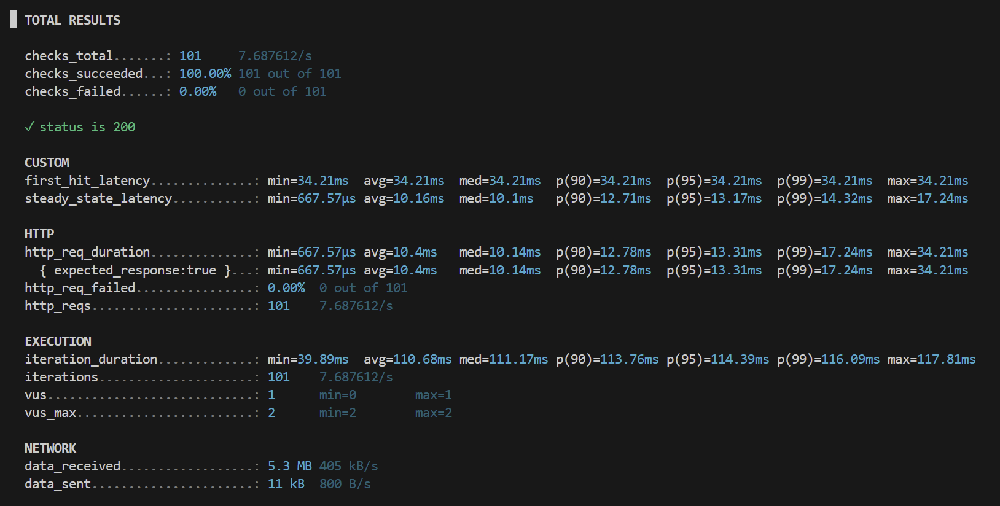
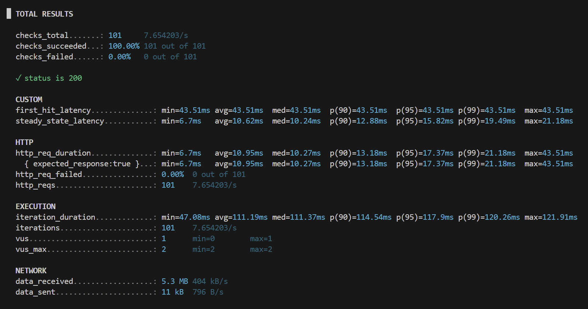
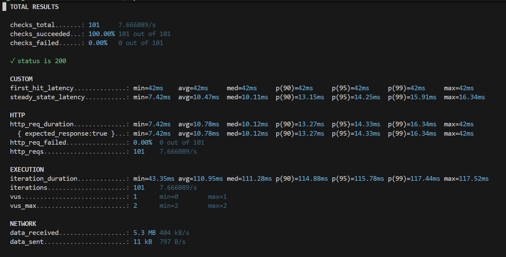
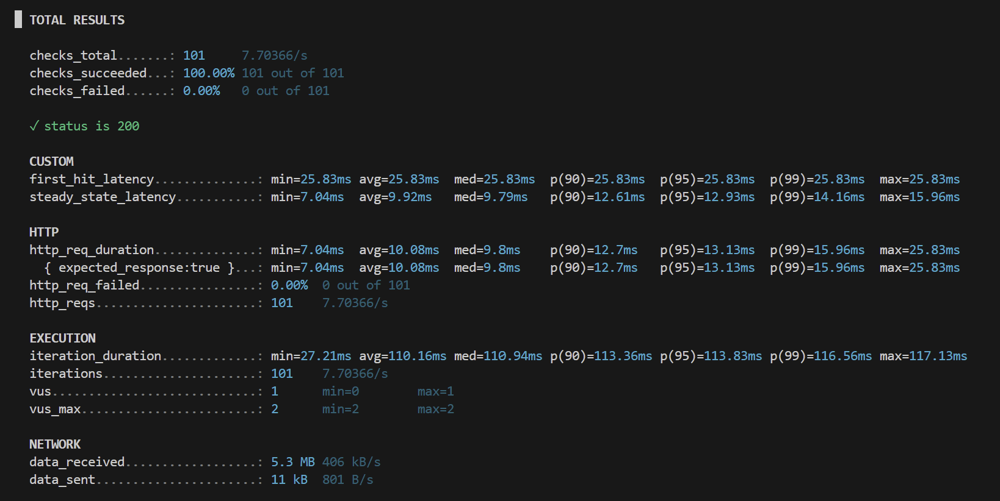
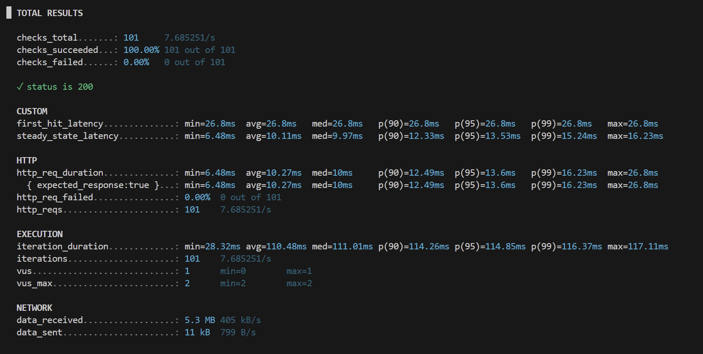

# 실험 04: Memory vs Disk 체감 차이 측정

## 배경

실험 03에서 "메모리 vs 디스크" 가설을 기각하면서, 자연스럽게 이런 질문이 남았다: 그렇다면 실제 메모리와 디스크 접근 간의 체감 차이는 얼마나 되는가? MySQL/MariaDB(InnoDB)는 데이터를 디스크에서 바로 읽지 않고 먼저 buffer pool(페이지 단위 메모리 캐시)을 거치므로, 이 buffer pool의 hit/miss를 이용해 직접 측정해보기로 했다.

처음에는 buffer pool을 비활성화해서 메모리/디스크 차이를 직접 비교하려 했지만, 설정 기준으로 사실상 비활성화가 불가능했고 최소 크기 제한(128MB)만 확인할 수 있었다. 따라서 이 실험의 핵심은 "buffer pool OFF"가 아니라, **"첫 요청(cold)"과 "이후 요청(steady-state)"의 체감 차이를 정량화**하는 것으로 방향을 바꿨다.

## 목표

- 동일 endpoint 기준 first-hit latency(첫 요청) 측정
- 동일 endpoint 연속 요청의 steady-state latency 분포(p50/p95/p99) 측정
- first-hit / steady-state 비율로 cold start 수치 정량화

## 조건

- 애플리케이션: Nest + Prisma
- DB: MariaDB (local)
- 부하 도구: k6
- 비교 항목: first-hit(cold) vs steady-state 연속 요청
- 반복 횟수: 5회

## 변경 내용 / 실험 설계

1. 테스트 직전 상태를 cold로 맞춘다 (DB 재시작, buffer pool dump/load 옵션 OFF)
2. 동일 endpoint에 단일 요청 1회만 보내서 first-hit latency 기록
3. 같은 endpoint를 연속 요청(100회)으로 보내 steady-state latency 분포 기록
4. 위 과정을 5회 반복
5. Redis 캐시(실험 03)와 섞이지 않도록 해당 실험에서는 Redis를 끄거나 우회함

실행 명령:

```bash
npm run loadtest:fvsst
```

## 결과

### 부하테스트 결과 (k6)

5회 반복 실행 결과에서 first-hit과 steady-state 지표를 추출해 비교했다.

| 회차 | first-hit (ms) | steady med (ms) | steady p95 (ms) | steady p99 (ms) | first/steady 비율 |
|---|---:|---:|---:|---:|---:|
| 1 | 43.51 | 10.24 | 15.82 | 19.49 | 4.25x |
| 2 | 42.00 | 10.11 | 14.25 | 15.91 | 4.15x |
| 3 | 25.83 | 9.79 | 12.93 | 14.16 | 2.64x |
| 4 | 26.80 | 9.97 | 13.53 | 15.24 | 2.69x |
| 5 | 34.21 | 10.10 | 13.17 | 14.32 | 3.39x |

요약:

- first-hit 평균: 34.47ms
- steady-state 중앙값 평균: 10.04ms
- first-hit / steady-state 비율: 약 3.43x
- 모든 회차에서 checks_failed 0%, http_req_failed 0%

<details>
<summary>회차별 원본 스크린샷 (k6 custom metrics)</summary>

| 회차 1 | 회차 2 | 회차 3 |
|---|---|---|
|  |  |  |

| 회차 4 | 회차 5 |
|---|---|
|  |  |

</details>

관측 포인트:

- steady-state 중앙값은 약 9.8~10.2ms로 매우 안정적
- first-hit은 25.8~43.5ms로 변동폭이 더 큼
- 즉 성능 꼬리는 steady-state보다 "첫 요청"에서 크게 발생

## 분석

### 가설: 첫 요청은 디스크를 타고, 이후 요청은 buffer pool(메모리)만 탄다

`Innodb_buffer_pool_reads`(실제 디스크 페이지를 읽은 횟수)와 `Innodb_buffer_pool_read_requests`(buffer pool에 대한 전체 읽기 요청 수)의 테스트 전/후 델타를 측정해서 검증했다.

**테스트 전**


**테스트 후**


| 지표 | 테스트 전 | 테스트 후 | 델타 |
|---|---:|---:|---:|
| Innodb_buffer_pool_read_requests | 19 | 61,633 | 61,614 |
| Innodb_buffer_pool_reads | 148 | 158 | 10 |

### 검증 결과

첫 first-hit 동안에는 `Innodb_buffer_pool_reads`가 10만큼 증가했고, 이후 steady-state 구간에서는 더 이상 증가하지 않았다.

- miss rate = 10 / 61,614 = 0.0162%
- hit rate = 99.9838%

즉 이 실험 구간의 대부분 읽기는 실제 디스크 I/O가 아니라 buffer pool hit로 처리됐고, 디스크 접근은 사실상 cold 상태의 첫 요청 근처에 집중되어 있었다.

## 결론

- 첫 요청은 steady-state 대비 일관되게 느렸다 (약 2.64x~4.25x, 평균 3.43x).
- steady-state 구간은 p95/p99까지 안정적으로 유지됐다 (중앙값 약 10ms 내외).
- 두 구간의 평균 차이는 약 15~20ms 수준으로, 이것이 실제 메모리와 디스크(buffer pool) 접근 간의 체감 차이에 해당한다.
- 실험 03에서 관찰했던 약 200ms 격차는 이 디스크 vs 메모리 차이(15~20ms)보다 10배 이상 크다. 즉 실험 03의 성능 차이는 디스크 I/O가 아니라 애초에 애플리케이션 레이어(쿼리 인터프리팅/JSON 역직렬화) 문제였다는 결론을 다시 한번 뒷받침한다.
- 이 실험은 단순 조회 API 기준이라 큰 문제가 되지 않았지만, cold 상태에서의 초기 로딩/워밍업 비용은 더 크고 복잡한 production 환경에서 사용자 체감 지연의 원인 중 하나가 될 수 있다.

## 관련 실험 / 다음 확인할 것

- [실험 03: Redis 캐싱 도입 전/후](../03-cache-implement/README.md) — 이 실험에서 나온 "디스크 vs 메모리 차이는 15~20ms"라는 기준값과 비교
- "buffer pool 비활성화" 자체는 현실적으로 쓸 수 있는 방법이 아니었음 — 향후 유사 실험 설계 시 참고

## 재현 절차

1. cold 상태로 맞추기
   - DB 재시작 후 `50-server.cnf` 설정에 다음 추가
   - `innodb_buffer_pool_dump_at_shutdown=OFF`
   - `innodb_buffer_pool_load_at_startup=OFF`
2. 테스트 전 상태 확인: `SHOW GLOBAL STATUS LIKE 'Innodb_buffer_pool_read%';`
3. 시나리오 k6 테스트 실행 (`npm run loadtest:fvsst`)
4. 테스트 후 상태 확인
5. 같은 과정을 5~10회 반복 후 비교
   - first-hit / steady-state 비율
   - steady-state p95/p99 안정성
   - `reads`, `read_requests` 델타 기반 hit/miss 비율

## 노트

- Redis 캐시(실험 03)와 결과가 섞이지 않도록 이 실험에서는 Redis를 끄거나 우회했다.
